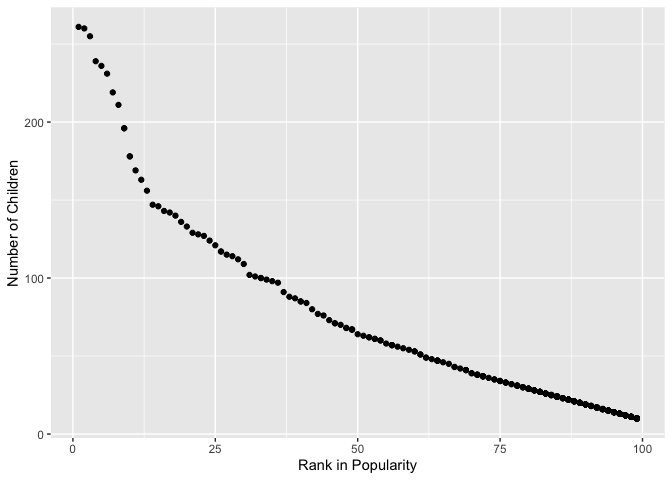

p8105\_hw2\_yw3438
================
Yuning Wang
9/24/2019

``` r
knitr::opts_chunk$set(echo = TRUE)

library(tidyverse)
library(dplyr)
library(readxl)
library(ggridges)
```

## Problem 1

``` r
# Import the data in Mr. Trash Wheel sheet
mr_trash_wheel = read_excel("./data/Trash-Wheel-Collection-Totals.xlsx",
                            sheet = "Mr. Trash Wheel",
                            skip = 1) %>%
  janitor::clean_names() %>%
  drop_na(dumpster) %>%
  mutate(sports_balls = as.integer(sports_balls))

# Import the data in precipitation data for 2018
pcptt_2018 = read_excel("./data/Trash-Wheel-Collection-Totals.xlsx",
                        sheet = "2018 Precipitation",
                        skip = 1) %>%
  janitor::clean_names() %>%
  mutate(year = "2018") %>%
  drop_na(total)
pcptt_2018
```

    ## # A tibble: 13 x 3
    ##    month total year 
    ##    <dbl> <dbl> <chr>
    ##  1     1  0.94 2018 
    ##  2     2  4.8  2018 
    ##  3     3  2.69 2018 
    ##  4     4  4.69 2018 
    ##  5     5  9.27 2018 
    ##  6     6  4.77 2018 
    ##  7     7 10.2  2018 
    ##  8     8  6.45 2018 
    ##  9     9 10.5  2018 
    ## 10    10  2.12 2018 
    ## 11    11  7.82 2018 
    ## 12    12  6.11 2018 
    ## 13    NA 70.3  2018

``` r
# Import the data in precipitation data for 2017
pcptt_2017 = read_excel("./data/Trash-Wheel-Collection-Totals.xlsx",
                        sheet = "2017 Precipitation",
                        skip = 1) %>%
  janitor::clean_names() %>%
  mutate(year = "2017") %>%
  drop_na(total)
pcptt_2017
```

    ## # A tibble: 13 x 3
    ##    month total year 
    ##    <dbl> <dbl> <chr>
    ##  1     1  2.34 2017 
    ##  2     2  1.46 2017 
    ##  3     3  3.57 2017 
    ##  4     4  3.99 2017 
    ##  5     5  5.64 2017 
    ##  6     6  1.4  2017 
    ##  7     7  7.09 2017 
    ##  8     8  4.44 2017 
    ##  9     9  1.95 2017 
    ## 10    10  0    2017 
    ## 11    11  0.11 2017 
    ## 12    12  0.94 2017 
    ## 13    NA 32.9  2017

``` r
# Combine precipitation datasets
pcptt_1718 = full_join(pcptt_2017, pcptt_2018) %>%
  mutate(month = month.name[month])
pcptt_1718
```

    ## # A tibble: 26 x 3
    ##    month     total year 
    ##    <chr>     <dbl> <chr>
    ##  1 January    2.34 2017 
    ##  2 February   1.46 2017 
    ##  3 March      3.57 2017 
    ##  4 April      3.99 2017 
    ##  5 May        5.64 2017 
    ##  6 June       1.4  2017 
    ##  7 July       7.09 2017 
    ##  8 August     4.44 2017 
    ##  9 September  1.95 2017 
    ## 10 October    0    2017 
    ## # … with 16 more rows

After reading and cleaning the data in Mr. Trash Wheel sheet, there are
344 observations of 17 variables in the dataset. The variables include
“dumpster, month, year, date, weight\_tons, volume\_cubic\_yards,
plastic\_bottles, polystyrene, cigarette\_butts, glass\_bottles”, among
which all the numbers in “sports\_balls” have been transformed into
integers.

After reading and cleaning the data in 2018 Precipitation, there are 13
observations of 3 variables in the dataset “pcptt\_2018”. The variables
include “month, total, year”.

After reading and cleaning the data in 2017 Precipitation, there are 13
observations of 3 variables in the dataset “pcptt\_2017”. The variables
include “month, total, year”.

The total precipitation in 2018 is 70.33 and the median number of
sports\_balls in 2017 is 8

## Problem 2

``` r
# Read the data in pol-month
pol_month = read_csv("./data/fivethirtyeight_datasets/pols-month.csv") %>%
  janitor::clean_names() %>%
  separate(mon, into = c("year", "month", "day"), sep = "-") %>%
  mutate(month = month.name[as.numeric(month)]) %>%
  pivot_longer(cols = starts_with("prez"),
               names_to = "president",
               names_prefix = "prez_") %>%
  select(-day) %>%
  filter(value %in% c(1, 2)) %>%
  select(-value)
pol_month
```

    ## # A tibble: 822 x 9
    ##    year  month    gov_gop sen_gop rep_gop gov_dem sen_dem rep_dem president
    ##    <chr> <chr>      <dbl>   <dbl>   <dbl>   <dbl>   <dbl>   <dbl> <chr>    
    ##  1 1947  January       23      51     253      23      45     198 dem      
    ##  2 1947  February      23      51     253      23      45     198 dem      
    ##  3 1947  March         23      51     253      23      45     198 dem      
    ##  4 1947  April         23      51     253      23      45     198 dem      
    ##  5 1947  May           23      51     253      23      45     198 dem      
    ##  6 1947  June          23      51     253      23      45     198 dem      
    ##  7 1947  July          23      51     253      23      45     198 dem      
    ##  8 1947  August        23      51     253      23      45     198 dem      
    ##  9 1947  Septemb…      23      51     253      23      45     198 dem      
    ## 10 1947  October       23      51     253      23      45     198 dem      
    ## # … with 812 more rows

``` r
# In pol_month, the prez_gop data has a value of "2". These values are considered to be same as "1" in this case as they both show that they won.

# Read the data in snp.csv
snp = read_csv("./data/fivethirtyeight_datasets/snp.csv") %>%
  janitor::clean_names() %>%
  separate(date, into = c("month", "day", "year"), sep = "/") %>%
  mutate(month = month.name[as.numeric(month)]) %>%
  arrange(year, month)
snp
```

    ## # A tibble: 787 x 4
    ##    month    day   year  close
    ##    <chr>    <chr> <chr> <dbl>
    ##  1 April    3     1950   18.0
    ##  2 August   1     1950   18.4
    ##  3 December 1     1950   20.4
    ##  4 February 1     1950   17.2
    ##  5 January  3     1950   17.0
    ##  6 July     3     1950   17.8
    ##  7 June     1     1950   17.7
    ##  8 March    1     1950   17.3
    ##  9 May      1     1950   18.8
    ## 10 November 1     1950   19.5
    ## # … with 777 more rows

``` r
# Read and tidy unemployment data
unemployment = read_csv("./data/fivethirtyeight_datasets/unemployment.csv") %>%
  janitor::clean_names() %>%
  pivot_longer(jan:dec,
               names_to = "month") %>%
  mutate(month = month.name[factor(month)]) %>%
  mutate(year = as.character(year))
unemployment
```

    ## # A tibble: 816 x 3
    ##    year  month     value
    ##    <chr> <chr>     <dbl>
    ##  1 1948  May         3.4
    ##  2 1948  April       3.8
    ##  3 1948  August      4  
    ##  4 1948  January     3.9
    ##  5 1948  September   3.5
    ##  6 1948  July        3.6
    ##  7 1948  June        3.6
    ##  8 1948  February    3.9
    ##  9 1948  December    3.8
    ## 10 1948  November    3.7
    ## # … with 806 more rows

``` r
# Merging snp into pol_month
  snp_pol = left_join(pol_month, snp, by = c("month", "year"))
# Merging unemployment data into one dataset
  snp_pol_unempl = left_join(snp_pol, unemployment, 
                             by = c("month", "year"))
  snp_pol_unempl
```

    ## # A tibble: 822 x 12
    ##    year  month gov_gop sen_gop rep_gop gov_dem sen_dem rep_dem president
    ##    <chr> <chr>   <dbl>   <dbl>   <dbl>   <dbl>   <dbl>   <dbl> <chr>    
    ##  1 1947  Janu…      23      51     253      23      45     198 dem      
    ##  2 1947  Febr…      23      51     253      23      45     198 dem      
    ##  3 1947  March      23      51     253      23      45     198 dem      
    ##  4 1947  April      23      51     253      23      45     198 dem      
    ##  5 1947  May        23      51     253      23      45     198 dem      
    ##  6 1947  June       23      51     253      23      45     198 dem      
    ##  7 1947  July       23      51     253      23      45     198 dem      
    ##  8 1947  Augu…      23      51     253      23      45     198 dem      
    ##  9 1947  Sept…      23      51     253      23      45     198 dem      
    ## 10 1947  Octo…      23      51     253      23      45     198 dem      
    ## # … with 812 more rows, and 3 more variables: day <chr>, close <dbl>,
    ## #   value <dbl>

The pol\_month dataset contains 822 rows and 9 colomns. The range of
years in pol\_month dataset is from 1947 to 2015. The names of key
variables in pol\_month are “year, month, gov\_gop, sen\_gop, rep\_gop,
gov\_dem, sen\_dem, rep\_dem, president”.

The snp dataset contains 787 rows and 4 colomns. The range of years in
pol\_month dataset is from 1950 to 2015. The names of key variables in
pol\_month are “month, day, year, close”.

The unemployment dataset contains 816 rows and 3 colomns. The range of
years in pol\_month dataset is from 1948 to 2015. The names of key
variables in pol\_month are “year, month, value”.

After merging snp and pol\_month, the new dataset, snp\_pol, contains
822 rows and 11 colomns. The range of years in pol\_month dataset is
from 1947 to 2015. The names of key variables in pol\_month are “year,
month, gov\_gop, sen\_gop, rep\_gop, gov\_dem, sen\_dem, rep\_dem,
president, day, close”.

After merging snp\_pol and unemployment, the new dataset,
snp\_pol\_unempl, contains 822 rows and 12 colomns. The range of years
in pol\_month dataset is from 1947 to 2015. The names of key variables
in pol\_month are “year, month, gov\_gop, sen\_gop, rep\_gop, gov\_dem,
sen\_dem, rep\_dem, president, day, close, value”.

## Problem 3

``` r
# Read the data
baby_names = read_csv("./data/Popular_Baby_Names.csv") %>%
  janitor::clean_names() %>%
  mutate(ethnicity = recode(ethnicity, 
                            "ASIAN AND PACI" = "ASIAN AND PACIFIC ISLANDER",
                            "BLACK NON HISP" = "BLACK NON HISPANIC",
                            "WHITE NON HISP" = "WHITE NON HISPANIC"),
         childs_first_name = str_to_lower(childs_first_name),
         ethnicity = str_to_lower(ethnicity)) %>%
  distinct()

# Make the table about "olivia"
olivia_rank = baby_names %>%
  filter(gender == "FEMALE" & childs_first_name == "olivia") %>%
  pivot_wider(
    names_from = "year_of_birth",
    values_from = "rank",
    id_cols = ethnicity
    )
olivia_rank
```

    ## # A tibble: 4 x 7
    ##   ethnicity                  `2016` `2015` `2014` `2013` `2012` `2011`
    ##   <chr>                       <dbl>  <dbl>  <dbl>  <dbl>  <dbl>  <dbl>
    ## 1 asian and pacific islander      1      1      1      3      3      4
    ## 2 black non hispanic              8      4      8      6      8     10
    ## 3 hispanic                       13     16     16     22     22     18
    ## 4 white non hispanic              1      1      1      1      4      2

``` r
# Figure out the most popular name among male children over time
boy_name = baby_names %>%
  filter(gender == "MALE", rank == 1) %>%
  select(-gender, -count, -rank) %>%
  pivot_wider(
    names_from = "year_of_birth",
    values_from = "childs_first_name")
boy_name
```

    ## # A tibble: 4 x 7
    ##   ethnicity                  `2016` `2015` `2014` `2013` `2012` `2011` 
    ##   <chr>                      <chr>  <chr>  <chr>  <chr>  <chr>  <chr>  
    ## 1 asian and pacific islander ethan  jayden jayden jayden ryan   ethan  
    ## 2 black non hispanic         noah   noah   ethan  ethan  jayden jayden 
    ## 3 hispanic                   liam   liam   liam   jayden jayden jayden 
    ## 4 white non hispanic         joseph david  joseph david  joseph michael

``` r
# Draw a scatter plot
m_wnh_2016 = baby_names %>%
  filter(gender == "MALE",
         ethnicity == "white non hispanic",
         year_of_birth == 2016) %>%
  ggplot(aes(x = rank, y = count)) +
  geom_point() +
  xlab("Rank in Popularity") +
  ylab("Number of Children") 
m_wnh_2016
```

<!-- -->
